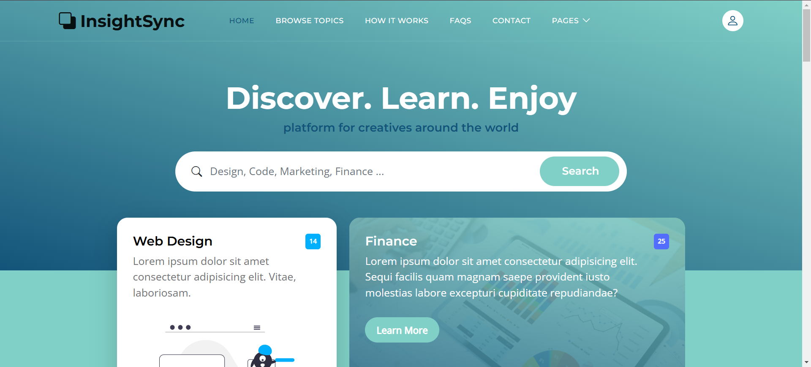

# InsightSync - Exploring Ideas, Expanding Horizons

Welcome to InsightSync! This platform is dedicated to exploring ideas and discovering insights all over the world. Our mission is to connect curious minds with valuable information and foster a community of learners.

### About

InsightSync aims to harmonize knowledge and curiosity by providing a user-friendly platform for users to explore various topics. We believe in the power of sharing insights and learning from one another to broaden perspectives.

### Features

- **Curated Content:** Access a wide range of articles and resources on diverse topics.
- **User-Friendly Interface:** Easy navigation and an engaging design enhance the user experience.
- **Community Discussions:** Connect with other users, share insights, and participate in discussions.
- **Free Access:** All features and content are available for free, promoting inclusive learning.

### Screenshots

Here are some screenshots of the InsightSync platform in action:

*Home Page*


*Browse Topics*


*Contact*


## Getting Started

### To get started with InsightSync:

1. **Clone the Repository:**  
   Clone the project to your local machine using the following command:
   ```bash
   git clone https://github.com/yourusername/insightsync.git
2. **Navigate to the Project Directory:**
   ```bash
   cd insightsync
3. **Create a New Branch:**
   Create a new branch for your feature or bug fix. Use a descriptive name:
   ```bash
   git checkout -b feature/YourFeatureName
4. **Perform Your Tasks:**
   Make the necessary changes and implement your feature or fix.
5. **Commit Your Changes:**
   Add and commit your changes with a meaningful message:
   ```bash
   git add .
   git commit -m "Add a brief description of your changes"
6. **Push Your Changes:**
   Push your branch to the remote repository:
   ```bash
   git push origin feature/YourFeatureName
7. **Create a Pull Request:**
   Once your changes are pushed, submit a pull request for review.

### Now setting up the backend:

1. Create a `.env` File

To store your environment variables securely, navigate to the `server` folder and create a `.env` file. This file will store your MongoDB connection string.

#### Format of `.env` File:
```bash
MONGO_URI="your_mongodb_connection_url"
```

Make sure to replace `your_mongodb_connection_url` with your actual MongoDB URL. Keep this file private and do not share it publicly.

---

2. Navigate to the `server` Folder

Before running the server, ensure that you are inside the `server` directory. You can check your current directory using:
```bash
pwd  # For macOS/Linux
cd  # For Windows (shows current directory)
```
If you are not in the `server` folder, navigate to it using:
```bash
cd server
```

---

3. Start the Server

Once inside the `server` folder, you can start the server using `nodemon`. Run the following command:
```bash
nodemon api/index.js
```
This will start your backend server, ensuring that any code changes will automatically restart the server.

If `nodemon` is not installed, you can install it globally using:
```bash
npm install -g nodemon
```

---

### If you want to deploy the Backend on Vercel

If you want to deploy your backend to Vercel, follow these steps:

1. Access the Vercel Website
Go to [Vercel](https://vercel.com/) and log in or sign up if you haven’t already.

2. Import the Repository
After logging in, import the **Insightsync forked repository** from your GitHub account.

3. Configure Deployment Settings
- In the **Root Directory** option, select the `server` folder.
- Add environment variables by clicking on the **Environment Variables** section.

4. Add the Environment Variable
Inside the Vercel project settings, add the following environment variable:
```bash
MONGO_URI="your_mongodb_connection_url"
```
Make sure to replace `your_mongodb_connection_url` with your actual MongoDB URL.

5. Deploy the Server
Click on the **Deploy** button to start the deployment process. After a few moments, your backend server will be deployed successfully!

You can now test your deployed API by checking the provided Vercel URL.
```
```


 

## Project Contributers: 
<a href="https://github.com/Dishika18/InsightSync/graphs/contributors">


---

### Thank You!

Thank you for your interest in contributing to InsightSync! Your efforts to explore ideas and share insights make a significant impact on our community. Together, we can foster curiosity, expand horizons, and create a platform that empowers learners everywhere. We look forward to your contributions and insights!
